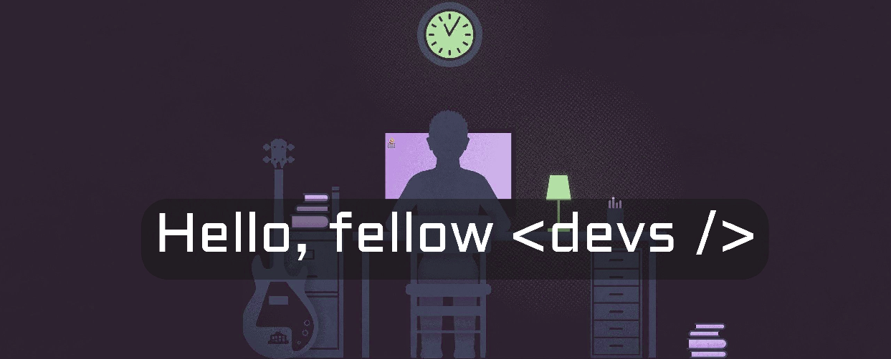

<h2>
My name is Jean Pierre Baraka Uwimana
</h2>

I am a software developer at Consumatech,

- 🔭 I’m currently working on portfolio website
- 🌱 I’m currently learning UI/UX design
- 👯 I’m looking to collaborate with other developers
- 💬 Ask me about anything
- 📫 How to reach me: send me an email at mugishaje@gmail.com
<!-- - ⚡ Fun fact: I hate fun facts. -->

<h2 align="center">I use the following technologies </h2> 

 

 

 

 

 

 

<!--  -->

 
  Visitor count  
  

<strong> 🤝🏻 &nbsp;Connect with Me: </strong>

